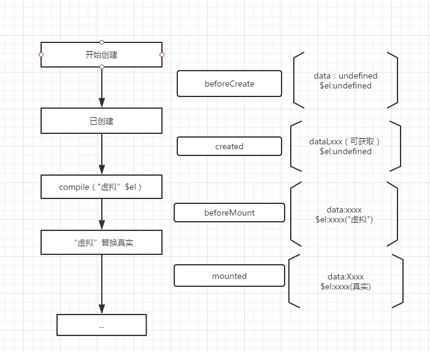

# **lvzu'daily tips**

> @author : lvzu  
> @date : 2017/9/27  
> @say: make progress everyday

## _2017/9/27_

- ### apache2 配置阿里云CA认证 
#### 简介
 我使用的是 __Symantec__ __FREE__ 版本的证书,
 域名 __https://world-elite.site__ 
 
 ####步骤
1. 在阿里云控制台购买证书，https://yundun.console.aliyun.com/?p=cas#/cas/home, 并绑定域名  

2. 下载apache2对应的证书，如图  
   

3. 将下载后的压缩包解压，得到四个文件，如图   
   

4. 在apache2安装目录下创建cert文件夹，将四个文件拷贝进去
   

5. 打开apache2 的ssl_mod   
 __a2enmod ssl__  
 
6. 配置根目录下ports.conf  
```javascript
Listen 80  
NameVirtualHost *:443
Listen 443
```
  
7. 进入sites-avaliable，先备份default-ssl.conf
然后配置
```c
  //https协议默认端口443
  ServerName https://world-elite.site:443
  
  SSLEngine on //打开ssl
  SSLProtocol all -SSLv2 -SSLv3//设置ssl协议
  SSLCipherSuite HIGH:!RC4:!MD5:!aNULL:!eNULL:!NULL:!DH:!EDH:!EXP:+MEDIUM//设置ssl加密算法
  SSLHonorCipherOrder on
  //配置ssl证书文件
  SSLCertificateFile      cert/public.pem
  SSLCertificateKeyFile cert/yournum.key
  SSLCertificateChainFile cert/chain.pem

```
8. 执行  __2ensite default-ssl__ 使default-ssl配置生效，然后执行 __service apache2 restart__ 重启apache2服务  

9. 打开你的页面查看效果，一般网站都会报一堆错误，因为配置ssl证书后的你页面中引用的资源，请求的地址等也需要是配置过证书的也就是https地址。慢慢改把

## _2017/9/28_

- ### 最近fileReader的两个使用场景

```javascript
var reader = new FileReader();

//读取图片绘制到canvas
reader.readAsDataURL(file);
reader.onload = function (e) {
  var fileResult = e.tartget.result
  var img = new Image()
  img.src = fileResult
  img.onload = function () {
    canvas.draw(img,0,0)
  }
}

//读取音频进行分析
reader.readAsArrayBuffer(file);
reader.onload = function (e) {
  var fileResult = e.tartget.result//arraybuffer
  _myAnalyse(fileResult)
}

```

### vue 生命周期一张图
 

## _2017/9/29_

### String 常用方法

```javascript
// 连接两个字符串文本，并返回一个新的字符串。
String.prototype.concat()
// 判断一个字符串里是否包含其他字符串。
String.prototype.includes()
// 使用正则表达式与字符串相比较。
String.prototype.match(RegExp)
// 返回指定重复次数的由元素组成的字符串对象。
var a = 'abc'.repeat(eval('1+5'))
// 对正则表达式和指定字符串进行匹配搜索，返回第一个出现的匹配项的下标。
String.prototype.search(RegExp)
// 摘取一个字符串区域，返回一个新的字符串。
a.slice(n-1,a.length)//返回第N个数到最后一个数
// 通过分离字符串成字串，将字符串对象分割成字符串数组。
String.prototype.split()
```
### Array.from() call() apply()
```javascript
//from()用法
Array.from(array,function)

Array.from([1, 2, 3], x => x + x);     
 
// call(),apply() 
    //定义一个remote类
   function Person(name,age)  
   {  
       this.name=name;  
       this.age=age;  
   }  
   //定义一个学生类
   function Student(name,age,grade)  
   {  
       Person.call(this,name,age) || Person.apply(this,arguments)
       this.grade=grade;  
   }  
   //创建一个学生类  
   var student=new Student("zhangsan",21,"一年级");  
   //测试  
   console.log("name:"+student.name+"\n"+"age:"+student.age+"\n"+"grade:"+student.grade);  

```


## _2017/9/30_

### 正则表达式总结
#### 常用整理
- \\^ &\ 开头与结尾
- \w 表示 [a-zA-Z0-9_] \d 表示 0-9 \s 表示空白字符
- 
- \* . ? + $ ^ [ ] ( ) { } | \ / 需要转义的字符
- | 表示左右两边的或
- [^a]表示除a以外的字符
- ？表示0或1次  \*表示随机次数 +表示1次及以上 {n,m} 表示n-m次 {n,} 表示n次以上  
- .表示任意字符 \\.表示匹配一个点
#### 常用练习
```javascript
const telRegExp = new RegExp(/^1(3|4|5|7|8)\d{9}$/)
const emailRegExp = new RegExp(/^[\w-]+@([a-z]+)+(\.[a-z]+)+$/)
const urlRegExp = new RegExp(/^(https?:(\/\/)?)?[\.\w-]+(\.[a-zA-Z])*(\.[a-zA-Z]{2,})$/,'i')
```