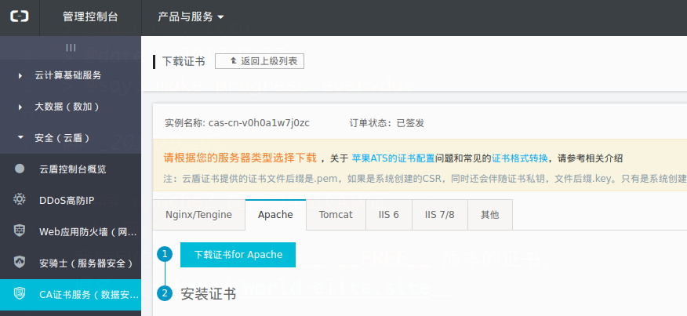
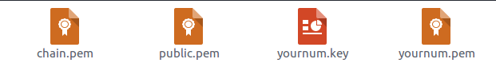
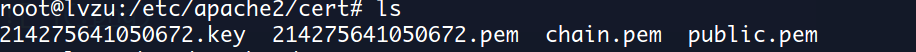

# **lvzu'daily tips**

> @author : lvzu  
> @date : 2017/9/27  
> @say: make progress everyday

## _2017/9/27_

- ### apache2 配置阿里云CA认证 
#### 简介
 我使用的是 __Symantec__ __FREE__ 版本的证书,
 域名 __https://world-elite.site__ 
 
 ####步骤
1. 在阿里云控制台购买证书，https://yundun.console.aliyun.com/?p=cas#/cas/home, 并绑定域名  

2. 下载apache2对应的证书，如图  
   

3. 将下载后的压缩包解压，得到四个文件，如图   
   

4. 在apache2安装目录下创建cert文件夹，将四个文件拷贝进去
   

5. 打开apache2 的ssl_mod   
 __a2enmod ssl__  
 
6. 配置根目录下ports.conf  
```javascript
Listen 80  
NameVirtualHost *:443
Listen 443
```
  
7. 进入sites-avaliable，先备份default-ssl.conf
然后配置
```c
  //https协议默认端口443
  ServerName https://world-elite.site:443
  
  SSLEngine on //打开ssl
  SSLProtocol all -SSLv2 -SSLv3//设置ssl协议
  SSLCipherSuite HIGH:!RC4:!MD5:!aNULL:!eNULL:!NULL:!DH:!EDH:!EXP:+MEDIUM//设置ssl加密算法
  SSLHonorCipherOrder on
  //配置ssl证书文件
  SSLCertificateFile      cert/public.pem
  SSLCertificateKeyFile cert/yournum.key
  SSLCertificateChainFile cert/chain.pem

```
8. 执行  __2ensite default-ssl__ 使default-ssl配置生效，然后执行 __service apache2 restart__ 重启apache2服务  

9. 打开你的页面查看效果，一般网站都会报一堆错误，因为配置ssl证书后的你页面中引用的资源，请求的地址等也需要是配置过证书的也就是https地址。慢慢改把

## _2017/9/28_

- ### 最近fileReader的两个使用场景

```javascript
var reader = new FileReader();

//读取图片绘制到canvas
reader.readAsDataURL(file);
reader.onload = function (e) {
  var fileResult = e.tartget.result
  var img = new Image()
  img.src = fileResult
  img.onload = function () {
    canvas.draw(img,0,0)
  }
}

//读取音频进行分析
reader.readAsArrayBuffer(file);
reader.onload = function (e) {
  var fileResult = e.tartget.result//arraybuffer
  _myAnalyse(fileResult)
}

```


