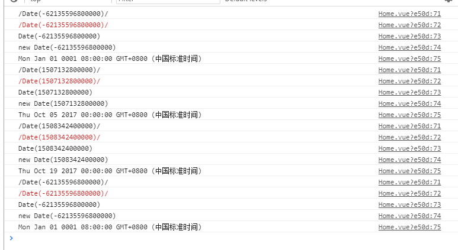

# **lvzu'daily tips**

##   make progress everyday

## _2017/10/16_

### cookie保存登录状态
- #### 写cookie
```javascript
var [cookieName,cookieValue,exp] = ['name','lvzu',new Date()]
exp.setTime(exp.getTime() + 1000 * 60 * 60 * 24); //1000ms*60*60*24 一天
document.cookie = `${cookieName}=${cookieValue};expires=${exp.toGMTString()}`// expires = 过期时间
```
- #### 读cookie
```javascript
//document.cookie返回一个字符串包含所有cookie信息
function getCookie(name) {
    var strCookie = document.cookie;
    var arrCookie = strCookie.split("; ");
    for (var i = 0; i < arrCookie.length; i++) {
        var arr = arrCookie[i].split("=");
        if (arr[0] == name)
            return arr[1];
    }
    return "";
}
```

## _2017/10/17_

### 浅谈Date
- 时间种类：
1. Unix时间戳：1508221990000
2. UTC：2017-10-17T14:20:13+08:00 协调世界时 中国为UTC+8
3. GMT：Tue, 17 Oct 2017 06:25:46 GMT 格林威治时间 比中国晚8小时
4. 中国标准时间：Tue Oct 17 2017 14:30:02 GMT+0800 
5. 日期格式：2017-10-17
6. 本地自定义日期和时间格式：2017-10-17 14:33:10 

- Date.format
```javascript
const DATEFORMATE = "yyyy-MM-dd hh:mm:ss";
const DATEFORMATE = "yyyy-MM-dd";
Date.prototype.Format = function (fmt) { //author: meizz 
    var o = {
        "M+": this.getMonth() + 1, //月份 
        "d+": this.getDate(), //日 
        "h+": this.getHours(), //小时 
        "m+": this.getMinutes(), //分 
        "s+": this.getSeconds(), //秒 
        "q+": Math.floor((this.getMonth() + 3) / 3), //季度 
        "S": this.getMilliseconds() //毫秒 
    };
    if (/(y+)/.test(fmt)) fmt = fmt.replace(RegExp.$1, (this.getFullYear() + "").substr(4 - RegExp.$1.length));
    for (var k in o)
    if (new RegExp("(" + k + ")").test(fmt)) fmt = fmt.replace(RegExp.$1, (RegExp.$1.length == 1) ? (o[k]) : (("00" + o[k]).substr(("" + o[k]).length)));
    return fmt;
}
var d = new Date()
d.format(DATEFORMATE)
```

```javascript
var d = new Date();
console.log(d); // 输出：Mon Nov 04 2013 21:50:33 GMT+0800 (中国标准时间)
console.log(Date.parse(d));//unix时间戳
console.log(d.toDateString()); // 日期字符串，输出：Mon Nov 04 2013
console.log(d.toGMTString()); // 格林威治时间，输出：Mon, 04 Nov 2013 14:03:05 GMT
console.log(d.toISOString()); // 国际标准组织（ISO）格式，输出：2013-11-04T14:03:05.420Z
console.log(d.toJSON()); // 输出：2013-11-04T14:03:05.420Z
console.log(d.toLocaleDateString()); // 转换为本地日期格式，视环境而定，输出：2013年11月4日
console.log(d.toLocaleString()); // 转换为本地日期和时间格式，视环境而定，输出：2013年11月4日 下午10:03:05
console.log(d.toLocaleTimeString()); // 转换为本地时间格式，视环境而定，输出：下午10:03:05
console.log(d.toString()); // 转换为字符串，输出：Mon Nov 04 2013 22:03:05 GMT+0800 (中国标准时间)
console.log(d.toTimeString()); // 转换为时间字符串，输出：22:03:05 GMT+0800 (中国标准时间)
```

### js-asp.net后台间的时间传递
- js接收 dotnet后台　DateTime类型对象
```javascript
var date = eval('new ' + eval(date).source)
```


- dotnet后台接收js fetch时间对象数据需要在前端转换
```javascript
fetch(url,{
  body:date.Format('yyyy-MM-dd')//Format函数自定义
})
```
- dotnet后台获取时间戳与从时间戳获取当前时间
```csharp
private long GetTimeStamp()
{
    DateTime startTime = TimeZone.CurrentTimeZone.ToLocalTime(new System.DateTime(1970, 1, 1)); 
    long timeStamp = (long)(DateTime.Now - startTime).TotalMilliseconds;
    return timeStamp;
}

private DateTime GetDateTime(long timeStamp)
{
    DateTime startTime = TimeZone.CurrentTimeZone.ToLocalTime(new System.DateTime(1970, 1, 1)); 
    DateTime dt = startTime.AddMilliseconds(timeStamp);
    return dt;
}
```
